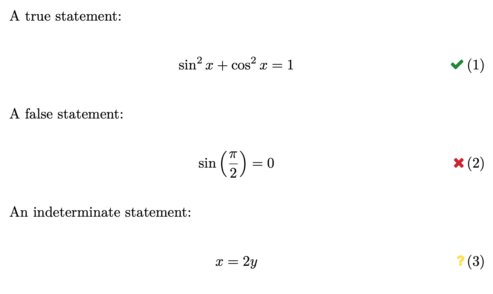

qed
===

Install:

```bash
python -m pip install .
```

File ``ms.tex``:

```latex
\documentclass{article}
\usepackage{qed}

\begin{document}

A true statement:

\begin{align}
    \sin^2 x + \cos^2 x = 1
\end{align}

A false statement:

\begin{align}
    \sin\left(\frac{\pi}{2}\right) = 0
\end{align}

An indeterminate statement:

\begin{align}
    x = 2 y
\end{align}

\end{document}
```

Compile:

```bash
pdflatex ms.tex
qed ms.tex
pdflatex ms.tex
```

File ``ms.pdf``:


